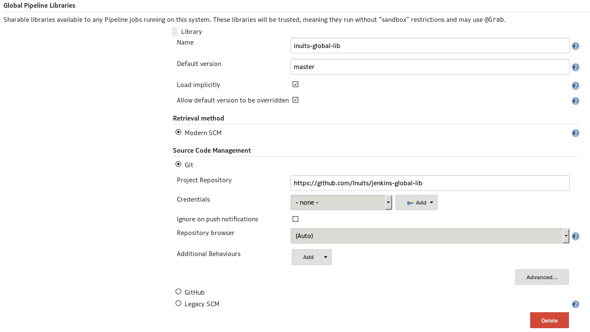

# A Global Library for Jenkins

This is a global library you can use in your Jenkins.

## How To

1. Install the [Pipeline Shared Groovy Libraries
   Plugin](https://wiki.jenkins-ci.org/display/JENKINS/Pipeline+Shared+Groovy+Libraries+Plugin)
1. Define this shared lib in you Jenkins:
    

## What is there?

### Remove Git Actions from a build

This is a workaround for [JENKINS-40622](https://issues.jenkins-ci.org/browse/JENKINS-40622).

When using multiple get repositories (with Pipeline) the build menu is useless.
To find the "Waiting for input" button, you need to scroll a lot.

The following code will remove all the "git actions" in individual builds menu:

```
import eu.inuits.BuildHelpers

node {
    checkout scm
    checkout scm2
    checkout scm3
    checkout scm4

    new BuildHelpers(this).removeGitActions()
}
```

*Requires Jenkins >= 2.29 or Jenkins LTS >= 2.31.1.*
